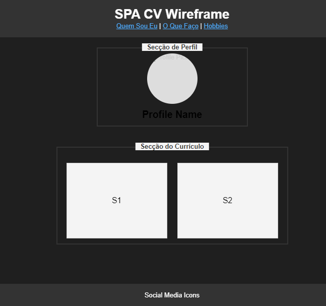

# Mini Projeto 1 - CV SPA
### Renan Pedreira de Oliveira - 2401854

## Introdução

Este projeto foi desenvolvido no âmbito da Unidade Curricular **Programação Web Avançada 2024**, do Mestrado em Engenharia Informática e Tecnologia Web da Universidade Aberta.

## Abordagem

O mini projeto 1, cujo tema centra-se na criação de uma SPA com tema de currículo vitae, foi concebido utilizando Vue.js. Para este feito foram realizadas as seguintes instalações:

- @vue/cli: Vue.js;
- @fortawesome/fontawesome-free: utilizado para icons de redes sociais.

Foi utilizado o comando **npm create vue@latest** para a criação de um projeto base, que foi totalmente alterado para cumprir com a proposta do projeto.

O design da página foi concebido através de código HTML, de um esqueleto daquilo que se pretendia como produto final.

O objetivo mais específico foi a criação de uma SPA com três secções:
- Quem sou eu: apresentação do autor;
- O que faço: descrição da atividade profissional do autor;
- Hobbies: atividades que o autor gosta de realizar nos tempos livres.

## Design

O SPA foi estruturado utilizando uma abordagem wireframe para definir a aparência e a organização de cada secção. Este design garante a consistência em todas as vistas e reflete a natureza da SPA, uma vez que todas as operações são feitas dentro de uma única página, carregada no início do processo. O Vue.js foi utilizado para a criação de componentes individuais, que podem ser reutilizadas. A seguinte imagem é referente ao esboço da aplicação, sendo este válido para todas as secções:



- **Cabeçalho**: A parte superior da página permite a navegação para cada secção do SPA (“Quem Sou Eu", “O Que Faço” e “Hobbies”). Este elemento mantém-se constante em todas as páginas do SPA.

- **Secção de Perfil**: Esta **componente** contém uma imagem de perfil do autor, seguida do nome deste. Está presente em todas as três secções, sendo global na SPA.
  
- **Secções do Currículo**: Cada uma das três secções corresponde a um **componente**, e está dividida em duas zonas S1 e S2, com o intuito de fornecer mais informação a cerca do autor. 
  - “Quem Sou Eu": Dividida em um texto sobre o autor(S1) e suas soft skills(S2). 
  - “O Que Faço”: divida em um texto sobre o atual cargo do autor(S1) e suas hard skills(S2). 
  - “Hobbies”: Dividia entre atividades indoor(S1) e outdoor(S2).

- **Rodapé**: Contém ícones de redes sociais que redirecionam para a respetiva página principal. Este elemento mantém-se constante em todas as páginas do SPA.


## Implementação

1. **Setup do Projeto**: Foi criado um projeto base utilizando o comando  `npm create vue@latest`, que forneceu uma configuração básica do Vue 3. Esta configuração incluía funcionalidades Vue modernas.
   
2. **Rodapé**: Preenchido com ícones de redes sociais, utilizando tags de ancoragem para redirecioanmento. Cada ícone representa uma plataforma social e fornece uma identidade virtual ao utilizador, cumprindo um requisito fundamental do projeto. Os ícones foram obtidos através da instalação do @fortawesome/fontawesome-free.

3. **Componentes**: 
   - **Secção de Perfil**: O **componente** Perfil contém a imagem e o nome do perfil, dando ao SPA um ponto focal constante em todas as secções.
   - **Secção do Currículo**: O SPA contém três **componentes** de conteúdo principais, cada um deles apresentando informações específicas:
     - *Quem Sou Eu*: Informação de introdução do autor.
     - *O Que Faço*: Informação profissional do autor.
     - *Hobbies*: Informação de interesses do autor.
     
     Cada um destes **componentes** carrega dinamicamente conteúdos para as caixas S1 e S2, assegurando um design consistente e acomodando conteúdos diversos.

4. **Routing**: Foi utilizado o Vue Router para gerir a navegação interna entre secções. Esta abordagem permite a navegação entre as diferentes secções sem ser precioso o recarregamento da página. Cada secção é carregada dinamicamente com base na rota selecionada, como espectável de uma SPA.

5. **Execução**: Para executar este projeto, deve estar no diretório **MiniProj1_WebDev\vue-spa-cv** e executar o comando **npm run dev**

## Project Setup

```sh
npm install
```

### Compile and Hot-Reload for Development

```sh
npm run dev
```

### Compile and Minify for Production

```sh
npm run build
```
